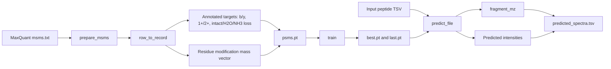
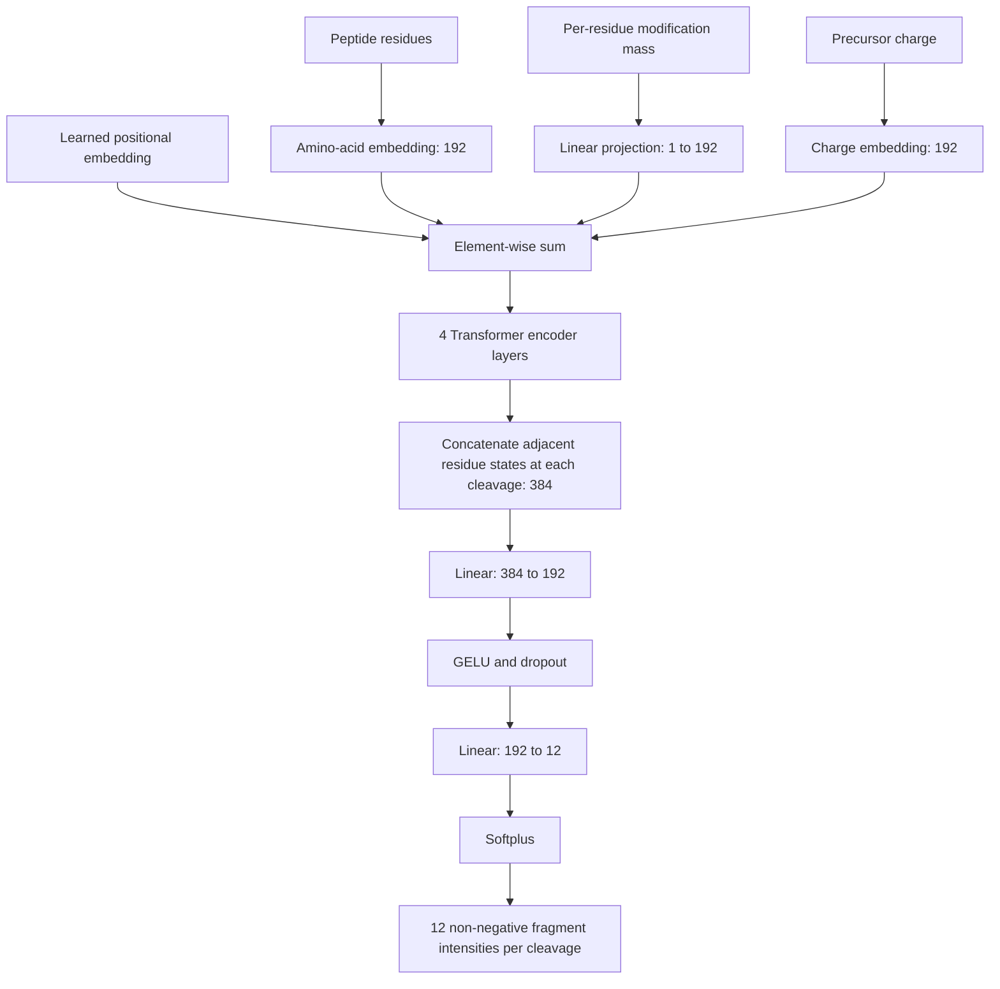
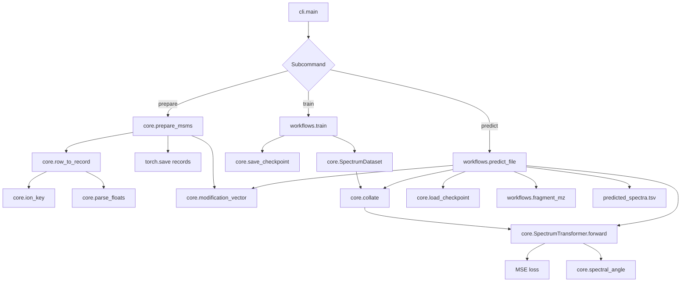

# PSMpredict

PSMpredict is a PyTorch pipeline that learns peptide HCD MS/MS fragment-intensity patterns from MaxQuant `msms.txt` files and predicts spectra for new peptide sequences. It supports CPU, NVIDIA CUDA, and AMD ROCm through PyTorch's standard device interface.

The current implementation is a functional prototype trained from local MaxQuant annotations. It is not a pretrained Prosit, pDeep, MS2PIP, or AlphaPeptDeep model and does not redistribute their weights.

## What the model predicts

For every peptide cleavage, PSMpredict predicts 12 relative-intensity channels:

- b and y ions
- fragment charges 1+ and 2+
- intact, `-H2O`, and `-NH3` forms

The model input is:

- unmodified peptide sequence
- residue-level modification mass shifts parsed from `Modified sequence`
- precursor charge, clipped to 1-8

The output contains one row per predicted fragment:

- `row_id`: row in the input peptide TSV
- `sequence`: peptide sequence
- `precursor_charge`: precursor charge supplied to the model
- `fragment`: fragment annotation, for example `y5`, `b3(2+)`, or `y4-H2O`
- `mz`: calculated monoisotopic fragment mass-to-charge ratio
- `predicted_intensity`: non-negative relative model score, not an absolute detector count

## Pipeline



## Neural network



Default model settings are `d_model=192`, 6 attention heads, 4 encoder layers, dropout 0.1, maximum peptide length 60, AdamW optimization, MSE loss, automatic mixed precision on GPU, and model selection by validation spectral angle.

## Code and function calls



### `src/psmpredict/cli.py`

Defines the `psmpredict` command and dispatches the `prepare`, `train`, and `predict` subcommands. It also exposes model and training parameters as command-line options.

### `src/psmpredict/core.py`

- `Config`: model, data, and optimization settings.
- `clean_sequence`: retains standard uppercase amino-acid letters.
- `parse_floats`: parses MaxQuant semicolon-separated intensity values.
- `modification_vector`: converts supported MaxQuant modification names into residue mass shifts.
- `ion_key`: maps MaxQuant fragment annotations to one of the 12 output channels.
- `row_to_record`: converts one annotated PSM into model inputs and a max-normalized target matrix.
- `prepare_msms`: streams one or more `msms.txt` files, filters records, creates training records, and writes `psms.pt` plus a JSON report.
- `SpectrumDataset` and `collate`: batch variable-length peptides, padding masks, modification masses, charges, and optional training targets.
- `SpectrumTransformer`: embeds inputs, applies the Transformer encoder, combines adjacent residue states at each cleavage, and predicts fragment intensities.
- `spectral_angle`: calculates the validation similarity score.
- `save_checkpoint` and `load_checkpoint`: store and restore model parameters and configuration.

### `src/psmpredict/workflows.py`

- `train`: creates a deterministic PSM-level train/validation split, trains with AdamW and MSE, records validation spectral angle, and saves `best.pt`, `last.pt`, and `history.tsv`.
- `fragment_mz`: calculates theoretical b/y fragment m/z values for charges 1+ and 2+, including H2O and NH3 losses.
- `predict_file`: reads peptide inputs, loads a checkpoint, predicts fragment intensities, calculates m/z values, and writes the output TSV.

### Other files

- `tests/test_core.py`: checks annotation mapping, target shape, normalization, and model output shape.
- `examples/peptides.tsv`: example prediction input.
- `scripts/lumi_*.sbatch`: LUMI preparation, training, and prediction jobs.
- `tools/plotPSM.py`: independent utility for plotting observed annotated MaxQuant spectra. It is not called by the training or prediction pipeline.

## Installation

### NVIDIA RTX 2070 SUPER with the tested driver

The validated local configuration was Python 3.13, PyTorch 2.5.1 with CUDA 12.1, and an NVIDIA GeForce RTX 2070 SUPER.

```bash
python -m venv .venv
source .venv/bin/activate
python -m pip install --upgrade pip
python -m pip install -e . pytest
python -m pip install torch==2.5.1 --index-url https://download.pytorch.org/whl/cu121
pytest -q
python -c "import torch; print(torch.__version__, torch.cuda.is_available(), torch.cuda.get_device_name(0))"
```

Expected GPU check:

```text
2.5.1+cu121 True NVIDIA GeForce RTX 2070 SUPER
```

The current tests pass with one non-fatal PyTorch warning about nested tensors and `norm_first=True`:

```text
2 passed, 1 warning
```

### LUMI AMD GPUs

Use the current LUMI AI Factory PyTorch container because it supplies the ROCm build matched to LUMI. Install only this package's Python code inside that environment:

```bash
python -m pip install --no-deps -e .
```

Do not replace the container's PyTorch installation with a CUDA wheel.

## Run

### 1. Prepare MaxQuant training data

```bash
mkdir -p work results/model logs
psmpredict prepare msms.txt --output work/psms.pt
```

Optional filtering and multiple inputs:

```bash
psmpredict prepare run1/msms.txt run2/msms.txt --output work/psms.pt --min-score 40
```

Required MaxQuant columns are `Sequence`, `Modified sequence`, `Charge`, `Matches`, and `Intensities`. `Score`, `Raw file`, and `Scan number` are used when present. `Masses2` and `Intensities2` are not used for training.

Preparation writes:

- `work/psms.pt`: serialized training records
- `work/psms.json`: record counts, output channels, and unsupported modification names

Supported mass shifts are oxidation, carbamidomethylation, phosphorylation, and protein N-terminal acetylation. Unsupported modifications are reported and currently encoded with zero mass shift.

### 2. Train

```bash
psmpredict train --data work/psms.pt --output-dir results/model
```

Outputs:

- `results/model/best.pt`: checkpoint with the highest validation spectral angle
- `results/model/last.pt`: final epoch checkpoint
- `results/model/history.tsv`: epoch-level training history

### 3. Predict spectra

Input TSV:

```text
Sequence	Modified sequence	Charge
PEPTIDE	_PEPTIDE_	2
MPEPTIDER	_M(Oxidation (M))PEPTIDER_	3
```

Run:

```bash
psmpredict predict --checkpoint results/model/best.pt --input examples/peptides.tsv --output results/predicted_spectra.tsv
```

## Latest validated run

The included run used 5,000 timsTOF PSMs:

- usable records: 5,000
- skipped records: 0
- training PSMs: 4,500
- validation PSMs: 500
- epochs: 15
- device: NVIDIA GeForce RTX 2070 SUPER through CUDA
- best validation spectral angle: 0.4535565 at epoch 3
- final training MSE: 0.0104826
- final validation spectral angle: 0.4446741
- prediction test: 2 peptides and 168 fragment rows on CUDA
- tests: 2 passed

Validation performance peaked at epoch 3 while training MSE continued to decrease, indicating overfitting after the early epochs. `best.pt`, not `last.pt`, should therefore be used for prediction.

The preparation report also identified `Deamidation (NQ)` as unsupported. Those residues were encoded with zero modification mass in this run, so modified-peptide interpretation involving deamidation is not valid until that modification is explicitly implemented.

For the example peptide `PEPTIDE`, the strongest predicted intact singly charged fragments were:

```text
y5  0.173870
y2  0.166720
y3  0.138128
y1  0.124141
y6  0.095861
y4  0.095105
```

These values are relative model outputs. They are not percentages and do not sum to one.

## LUMI jobs

Edit `project_XXXXXXXXX` in each SLURM script and set `LUMI_TORCH_SIF` to the current LUMI PyTorch container before submission:

```bash
sbatch scripts/lumi_prepare_cpu.sbatch
export LUMI_TORCH_SIF=/path/to/current-lumi-pytorch.sif
sbatch scripts/lumi_train_gpu.sbatch
sbatch scripts/lumi_predict_gpu.sbatch
```

The provided scripts use one GPU, seven CPU cores for GPU jobs, ROCm-enabled Apptainer execution, and local MIOpen caches. They have not yet been validated on an actual LUMI compute node.

## Interpretation and limitations

- The current model is trained from only 5,000 PSMs and has a best validation spectral angle of 0.454. It is a working prototype, not a production-quality or publication-ready predictor.
- The default split is random by PSM. Repeated peptide sequences may occur in both sets, making validation optimistic.
- Only MaxQuant-annotated b/y ions, charges 1+/2+, and intact/H2O-loss/NH3-loss channels are modeled.
- Collision energy, instrument identity, fragmentation method, and ion mobility are not model inputs.
- Unsupported modifications are encoded with zero mass shift and listed in `psms.json`.
- Targets are normalized independently to the strongest supported annotated fragment in each PSM.
- Unannotated channels are treated as zero, which may conflate genuinely absent fragments with unidentified or unreported peaks.
- Predicted values are relative intensities, not calibrated probabilities, percentages, or detector counts.
- Fragment m/z calculations are theoretical and are not learned by the network.
- The supplied LUMI scripts are templates and require project and container configuration before use.

For stronger evaluation, train on substantially more PSMs and benchmark against raw-file-held-out peptides, runs, and instruments. Split by peptide sequence or raw file rather than by individual PSM when reporting generalization.

## Literature context

- Gessulat et al. Prosit. *Nature Methods* (2019). DOI: [10.1038/s41592-019-0426-7](https://doi.org/10.1038/s41592-019-0426-7)
- Zhou et al. pDeep. *Analytical Chemistry* (2017). DOI: [10.1021/acs.analchem.7b00006](https://doi.org/10.1021/acs.analchem.7b00006)
- Degroeve and Martens. MS2PIP. *Bioinformatics* (2013). DOI: [10.1093/bioinformatics/btt447](https://doi.org/10.1093/bioinformatics/btt447)
- Zeng et al. AlphaPeptDeep. *Nature Communications* (2022). DOI: [10.1038/s41467-022-34904-3](https://doi.org/10.1038/s41467-022-34904-3)

## Reproducibility

The pipeline seeds Python, NumPy, and PyTorch. Exact results may still depend on PyTorch, CUDA/ROCm, GPU, and driver versions. Record the software environment, Git commit, training report, and `history.tsv` for each experiment.
